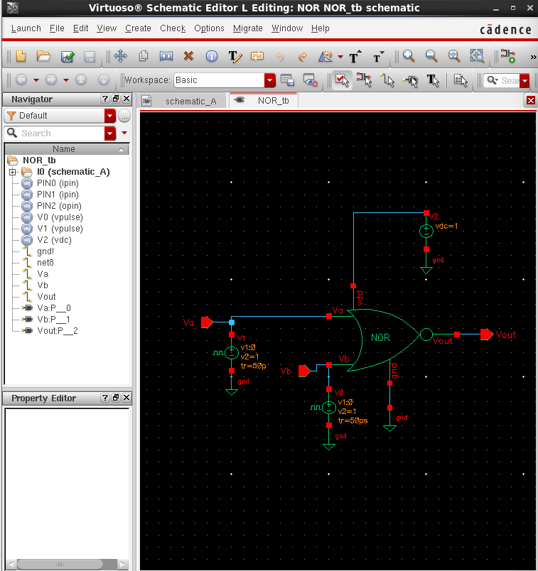
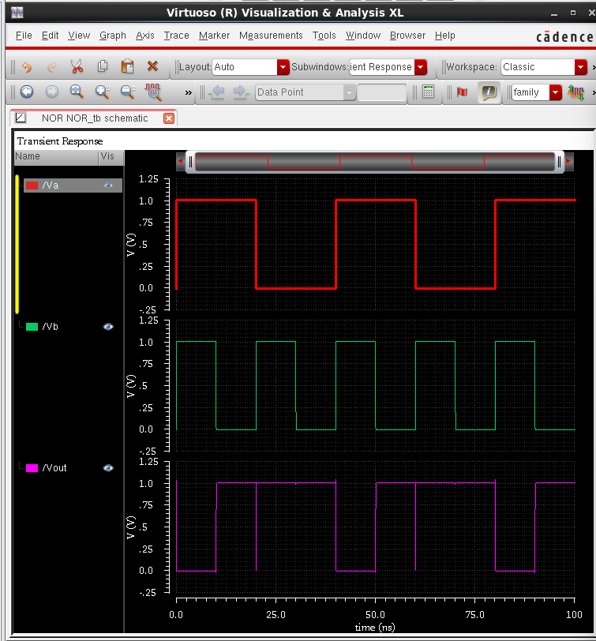

# 2-Input NOR Gate (CMOS Implementation)

This repository contains the design, schematic, testbench, and simulation results of a **2-input NOR gate** using CMOS technology in Cadence Virtuoso.

---

## 1. Schematic Diagram

This image displays the transistor-level circuit diagram of the **2-input NOR gate**.  
The core of this circuit is built using **CMOS (Complementary Metal-Oxide-Semiconductor)** technology.

- **Pull-up Network (PMOS Transistors):**  
  - Two PMOS transistors (**PM0, PM1**) are connected in **parallel** between the power supply (VDD) and the output (Vout).  
  - Responsible for pulling the output **high (VDD)** when at least one of the inputs (**Va OR Vb**) is low.  

- **Pull-down Network (NMOS Transistors):**  
  - Two NMOS transistors (**NM0, NM1**) are connected in **series** between the output (Vout) and ground (gnd).  
  - Responsible for pulling the output **low (gnd)** when both inputs (**Va AND Vb**) are high.  

- **Inputs & Outputs:**  
  - The inputs are tied to the gates of both the PMOS and NMOS transistors.  
  - The output is low only when **both inputs are high**, which defines NOR functionality.  

---

## 2. Schematic Symbol

This is the **simplified schematic symbol** for the 2-input NOR gate.  
It abstracts the transistor-level design into a reusable block.

- **Inputs:** `Va`, `Vb`  
- **Output:** `Vout`  
- **Power Pins:** VDD and gnd are included for proper operation.  

This symbolic representation makes it easier to use the NOR gate in larger circuits without drawing every transistor.

---

## 3. Testbench Setup

The **testbench** is used to simulate and verify the NOR gate functionality.

- **Input Signals:**  
  Two voltage pulse sources (`V0`, `V1`) generate digital input combinations (00, 01, 10, 11).  

- **Power Supply:**  
  A DC source (`V2`) provides `VDD = 1V`.  

- **Circuit Under Test:**  
  The NOR gate symbol (`I0`) is placed in the center, with proper connections to inputs and output probes.  

---

## 4. Transient Simulation Results

This image shows the **transient analysis results** of the NOR gate.

- **Inputs (Va, Vb):**  
  - Top two waveforms (Red = Va, Green = Vb).  
  - Represent digital logic levels (0 = Low, 1 = High).  

- **Output (Vout):**  
  - Bottom waveform (Magenta).  
  - Shows NOR gate response to inputs.  

### Truth Table Verification

| Va | Vb | Vout |
|----|----|------|
| 0  | 0  | 1    |
| 0  | 1  | 0    |
| 1  | 0  | 0    |
| 1  | 1  | 0    |

The simulation confirms that the circuit behaves as a **2-input NOR gate**.

---

## 5. Applications

- Used in **combinational logic circuits**.  
- Fundamental building block in **digital systems**.  
- Basis for **universal logic design**, since any logic function can be built using NOR gates.  

---

## 6. Advantages & Disadvantages

**Advantages:**  
- CMOS design ensures **low power consumption**.  
- High noise immunity.  
- Scalable for integration into **VLSI systems**.  

**Disadvantages:**  
- Slightly more transistor count compared to NAND gates.  
- Increased propagation delay when scaled to larger fan-in gates.  

---

##  Author
Designed and simulated in **Cadence Virtuoso** using CMOS 95nm Technology.  

